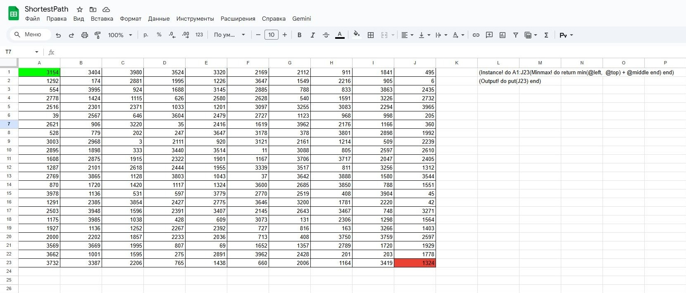

# Cell



**Cell** is an **experimental, array-focused programming language** that lives inside spreadsheets. It compiles OpenDocument Spreadsheets (`.ods`) directly into highly optimized, standalone WebAssembly (`.wasm`) binaries.

> **⚠️ Note**: This project is a **recreational prototype**. It was built for fun and experimentation to explore what's possible when you treat spreadsheets as a compile target.

Unlike traditional spreadsheet engines that interpret formulas at runtime, Cell compiles the logic—treating **arrays as first-class citizens**—into machine-code-ready WebAssembly. This enables ultra-low-latency calculations, making it ideal for running complex financial models, physics simulations, or game logic directly in the browser.

## ◆ Key Features

*   **Zero Overhead**: Formulas are compiled, not interpreted.
*   **Active vs Static**: Distinguish between code that runs automatically and data that sits passively.
*   **Relative Addressing**: Address neighbors naturally with `@left`, `@top`, etc.
*   **WebAssembly Native**: Outputs standard `.wasm` files compatible with any WASM runtime.

---

## ◆ The Cell Language (Re-imagined)

Cell uses a unique block syntax designed for easy writing within single spreadsheet cells.

### 1. Data Cells vs Code Cells
*   **Data Cells**: Plain values (Numbers, Strings). They are loaded into memory but DO NOT execute.
    *   Example: `10`, `3.14`, `"Hello World"`
*   **Code Cells**: Defined by wrapping content in `(Name do ... end)`.

### 2. Active vs Lazy Functions
*   **Active Functions (`Name!`)**: Functions ending with `!` are automatically added to the main execution loop. They run every frame.
    *   Syntax: `(Updates! do put(@left) end)`
*   **Lazy Functions (`Name`)**: Functions without `!` are compiled but only run when called by other functions.
    *   Syntax: `(Helper do return 10 end)`

### 3. Usage Example
**Cell A1** (Data):
```
10
```

**Cell B1** (Active Code):
```ruby
(Main! do
  # Read A1 using relative addressing
  val = @left
  put(val + 1)
end)
```

**Cell C1** (Function with Arguments):
```ruby
(AddTwo a b do
  return a + b
end)
```

### 4. Relative Addressing
Cell provides semantic relative addressing directions:
*   `@left`  : Cell to the immediate left (Column - 1)
*   `@right` : Cell to the immediate right (Column + 1)
*   `@top`   : Cell immediately above (Row - 1)
*   `@bottom`: Cell immediately below (Row + 1)
*   `@middle`: The current cell (Column, Row) - useful for fetching the original value.

### 5. Math & Performance Example
Standard vs Quake optimization:
```ruby
(MathTest! do
  dist = hypot(30, 40)       # 50.0 (Standard)
  qdist = q_hypot(30, 40)    # ~49.99 (Fast Approx)
end)
```

---

## ◆ Syntax Reference

### Control Flow
**Blocks**
```ruby
(MyFunc! do
  x = 10
  y = 20
end)
```

**Conditionals**
```ruby
if x > 10: return 100
# OR
if x > 10 do
  return 100
else
  return 0
end
```

**Loops**
```ruby
while i < 10 do
  i = i + 1
end

for i in range 10 do
  put(i)
end
```

### Operators
**Monadic (Unary)**
*   `Negate`, `Not`
*   Array Ops (Planned/Partial): `Flip`, `First`, `Sqrt`, `Odometer`, `Where`, `Reverse`, `Group`, `Null`, `Length`, `Floor`, `Unique`, `Type`, `Eval`

**Dyadic (Binary)**
*   **Math**: `+`, `-`, `/`, `*` (Power), `×` (Multiply), `Mod`
*   **Logic**: `And`, `Or`, `Equal`, `Match`, `Less`, `More`
*   **Array Ops** (Planned/Partial): `Right`, `Concat`, `Take`, `Drop`, `Pad`, `Find`, `Apply`

### Built-in Functions
*   `put(val)`: Debug print.
*   `input()`: Get number from host.
*   `rand(min, max)`: Random integer.

### Math Library
*   **General**: `log(x)`, `pow(b, e)`, `floor(x)`, `ceil(x)`, `round(x)`
*   **Trigonometry**: `sin`, `cos`, `tan`, `asin`, `acos`, `atan`
*   **Stats**: `min(a, b)`, `max(a, b)`
*   **Geometry**:
    *   `hypot(dx, dy)`: Standard high-precision hypotenuse.
    *   `q_hypot(dx, dy)`: Optimized approximation using the Quake Fast Inverse Square Root algorithm.
    *   `q_rsqrt(x)`: The raw Fast Inverse Square Root (`0x5fe6eb50c7b537a9`).

---

### 6. Advanced Addressing & Injection
**Relative Movement/Offset**
* `A1 move 1` (Offset column +1)
* `A1 drop 1` (Offset row +1)

**Instance Application**
Apply a function to a range of cells. This can be used for complex algorithms like Shortest Path:

```ruby
(Instance! do
  # Apply Minmax computation to a 10x23 grid
  A1:J23(Minmax! do
    # Pathfinding: result = min(path_above, path_left) + distance_here
    return min(@left, @top) + @middle
  end)
end)

(Output! do
  put(J23) # Output the final shortest path value
end)
```

**Data Injection (Wasm Exports)**
The compiler exports `allocate` and `process_data` to allow injecting data from the host (JS/Deno):
```typescript
const ptr = allocate(size);
process_data(charCode, ptr, length);
```

---

## ◆ Running Examples with Deno

You can execute the compiled `.wasm` binaries using the included `run.ts` script with [Deno](https://deno.land/).

### 1. Build the Compiler
```bash
cargo build --release
```

### 2. Compile an Example
```bash
# Compile FizzBuzz
target/release/cell examples/fizzbuzz.csv -o Executables/fizzbuzz.wasm
```

### 3. Run with Deno
```bash
deno run --allow-read run.ts Executables/fizzbuzz.wasm
```


---


## ◆ Architecture

1.  **Loader**: Reads ODS/CSV structure.
2.  **Parser**: Parses `(Name do ... end)` blocks and data cells.
3.  **Codegen**:
    *   Resolves `@left/@right` to absolute memory offsets.
    *   Initialization function populates memory with Data Cell values.
    *   Main Loop iterates only over **Active** (`!`) functions.
4.  **Output**: Standalone `.wasm`.

## ◆ Contributing

Contributions are welcome! Please submit a Pull Request or open an Issue to discuss new operators or features.

License: MIT
